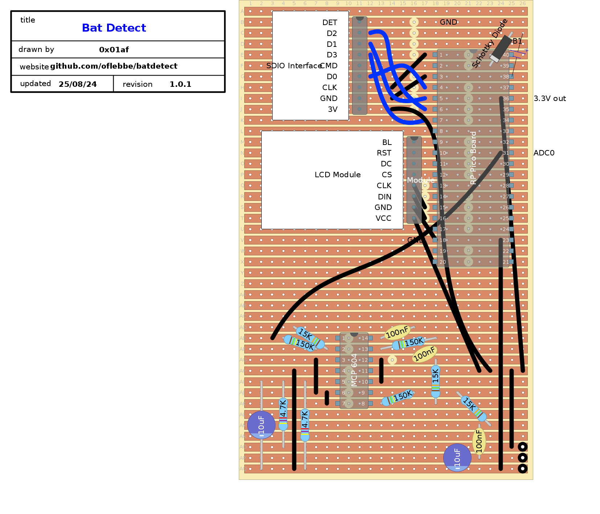

# BATDETECT

Project for an DIY Bat detector based on ultrasound spectrum analysis.

# Hardware
* MEMS microphone [from ELV](https://de.elv.com/elv-mikrofon-mems1-komplettbausatz-151456)
* st7789 240x240 display with SPI interface
* SDIO SD Card interface [from Adafruit](https://www.adafruit.com/product/4682)
* ~~RP2040 Raspberry [Pico board](https://www.raspberrypi.com/products/raspberry-pi-pico/)~~
* RP2350 Raspberry [Pico2 board](https://www.raspberrypi.com/products/raspberry-pi-pico-2/)

## ~~RP2040~~ RP2350 Pins used
st7789 is using SPI instance spi1

|Signal|Pin|
|-------|----|
|CS | 9|
|DC | 8|
|RST | 7|
|BL | 6|
|TX | 11|
|CLK| 10|

SDIO card is using (see `hw_config.c`)
  
|Signal|Pin|
|-------|----|
|D0 |2|
|D1 |3|
|D2 |4|
|D3 |5|
|CMD|1|

## Vero/Stripboard layout
Drawn with the highly recommend [DIY Layout Creator](https://diy-fever.com/software/diylc/) (available as Flatpak, Mac and Windows). [DIY Layout Creator file](batdetect.diy)

  

## Credits
The software depends on the [Raspberry pico SDK Version 2](https://github.com/raspberrypi/pico-sdk).
[kissfft](https://github.com/mborgerding/kissfft)
[no-OS-FatFS-SD-SDIO-SPI-RPi-Pico](https://github.com/carlk3/no-OS-FatFS-SD-SDIO-SPI-RPi-Pico)

## Possible Improvements
   * Set time on files correctly: see [get_fattime](https://github.com/carlk3/no-OS-FatFS-SD-SDIO-SPI-RPi-Pico/blob/cd0b9168272828a3341515028f3496229ed28877/src/src/rtc.c#L84C7-L84C18). But where to get the time from ?
   * Obsolete with pico2?: Have an PIO program when reading ADC to store 3 bytes only
   * Obsolete with pico2?: Use 256 FFT, but have the load shared in both cores
   * Should use subdirectry rather root dir
   * Datalogger only
   * GPS data

## Bugs
* ~~Some green lines on the lower display~~
* ~~Orientation is wrong~~

